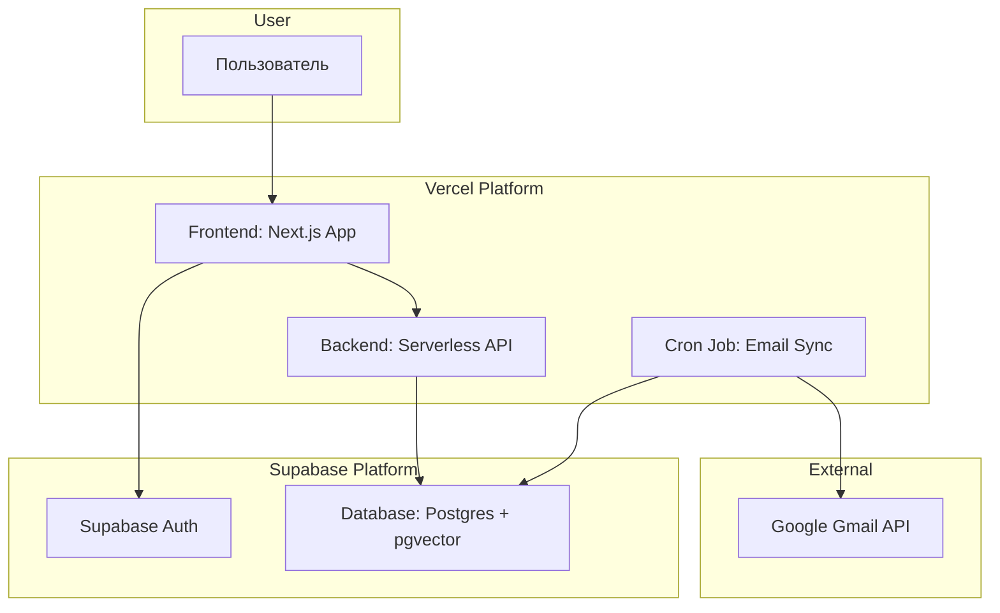

# **Раздел 1: Высокоуровневая архитектура**

## **Техническое резюме**

Проект "Jessie" будет реализован как современное full-stack приложение на стеке Vercel + Supabase. Архитектура состоит из frontend на Next.js (с TypeScript), развернутого на Vercel, и backend в виде бессерверных функций на TypeScript. Данные и векторы будут храниться в PostgreSQL с расширением pgvector от Supabase. Проект будет организован в виде монорепозитория.

## **Выбор платформы и инфраструктуры**

* **Рекомендация**: **Vercel + Supabase.**  
* **Обоснование**: Скорость разработки, отличная интеграция, экономическая эффективность для MVP и хорошая масштабируемость.

## **Структура репозитория**

* **Решение**: **Monorepo**.

## **Диаграмма высокоуровневой архитектуры**

## **Архитектурные паттерны**

* **Jamstack**: Быстрый frontend с динамикой через API.  
* **Serverless Functions**: Вся логика backend в бессерверных функциях.  
* **Repository Pattern**: Абстрагирование логики работы с базой данных. 