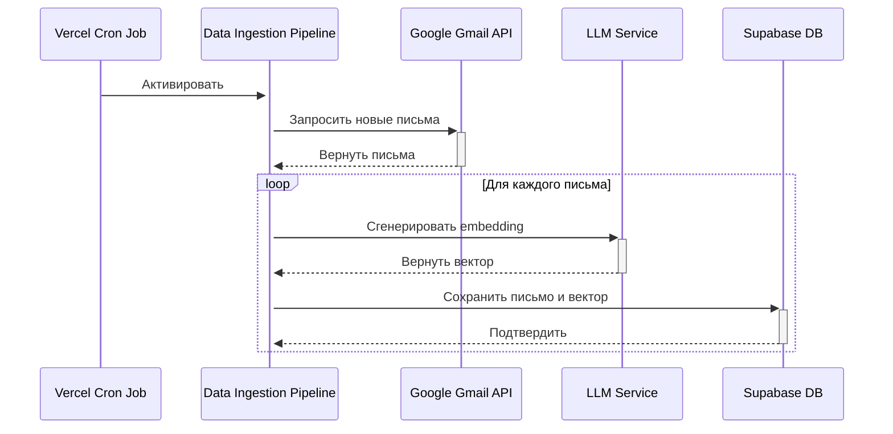
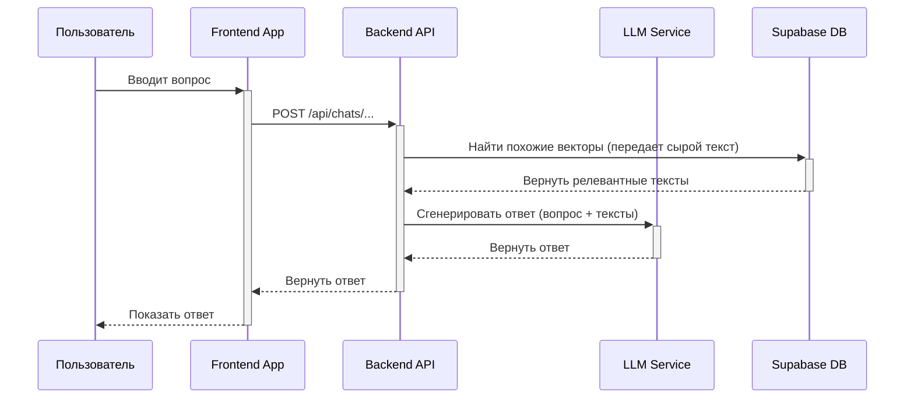

# **Раздел 7: Ключевые рабочие процессы**

* **Процесс 1: Фоновый сбор и индексация писем**  

```mermaid
sequenceDiagram
    participant Cron as Vercel Cron Job
    participant Ingestion as Data Ingestion Pipeline
    participant Gmail as Google Gmail API
    participant LLM as LLM Service
    participant DB as Supabase DB
    Cron->>+Ingestion: Активировать
    Ingestion->>+Gmail: Запросить новые письма
    Gmail-->>-Ingestion: Вернуть письма
    loop Для каждого письма
        Ingestion->>+LLM: Сгенерировать embedding
        LLM-->>-Ingestion: Вернуть вектор
        Ingestion->>+DB: Сохранить письмо и вектор
        DB-->>-Ingestion: Подтвердить
    end
```

* **Процесс 2: Запрос пользователя и генерация ответа (оптимизированный)**  

```mermaid
sequenceDiagram
    participant User as Пользователь
    participant Frontend as Frontend App
    participant API as Backend API
    participant LLM as LLM Service
    participant DB as Supabase DB
    User->>+Frontend: Вводит вопрос
    Frontend->>+API: POST /api/chats/...
    API->>+DB: Найти похожие векторы (передает сырой текст)
    DB-->>-API: Вернуть релевантные тексты
    API->>+LLM: Сгенерировать ответ (вопрос + тексты)
    LLM-->>-API: Вернуть ответ
    API-->>-Frontend: Вернуть ответ
    Frontend-->>-User: Показать ответ
``` 